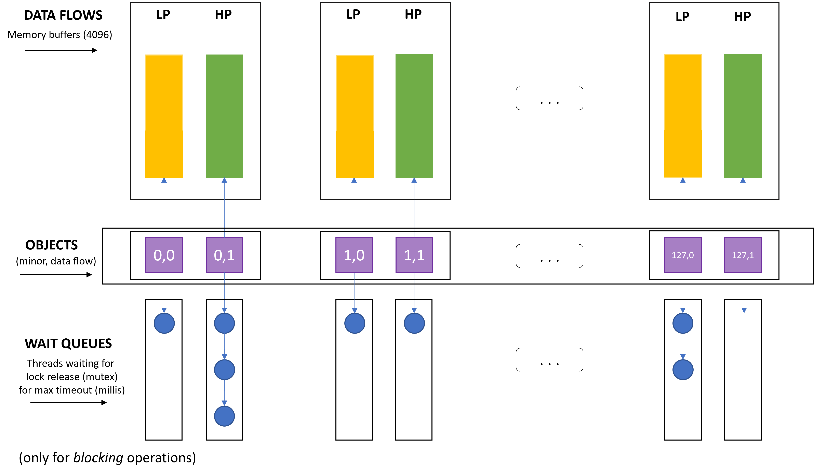

##### Bencivenni Gianmarco - 0285847 - SOA A.A. 2021/2022

# **Multi-flow device file**

## Specifiche di progetto
----

" This specification is related to a Linux device driver implementing low and high priority flows of data. 
Through an open session to the device file a thread can read/write data segments. 
The data delivery follows a First-in-First-out policy along each of the two different data flows (low and high priority). 
After read operations, the read data disappear from the flow. 
Also, the high priority data flow must offer synchronous write operations while the low priority data flow must offer an asynchronous execution (based on delayed work) of write operations, while still keeping the interface able to synchronously notify the outcome. 
Read operations are all executed synchronously. 
The device driver should support 128 devices corresponding to the same amount of minor numbers.
The device driver should implement the support for the ioctl(..) service in order to manage the I/O session as follows:
- setup of the priority level (high or low) for the operations
- blocking vs non-blocking read and write operations
- setup of a timeout regulating the awake of blocking operations

A few Linux module parameters and functions should be implemented in order to enable or disable the device file, in terms of a specific minor number. If it is disabled, any attempt to open a session should fail (but already open sessions will be still managed). 
Further additional parameters exposed via VFS should provide a picture of the current state of the device according to the following information:
- enabled or disabled
- number of bytes currently present in the two flows (high vs low priority)
- number of threads currently waiting for data along the two flows (high vs low priority) "

## Implementazione
----

#### **File Operations**

Realizzare il *char device driver* sopra descritto significa andare a specificare il comportamento delle *file operations*, quindi fornire una specifica implementazione della logica che il driver deve mettere in atto nel momento in cui un thread di livello utente va ad invocare i servizi per operare in I/O (syscall open, write, read, ioctl, close) su uno dei 128 device file di sua competenza.
```C
static int dev_open(struct inode *, struct file *);
static int dev_release(struct inode *, struct file *);
static ssize_t dev_write(struct file *, const char *, size_t, loff_t *);
static ssize_t dev_read(struct file *filp, char *buff, size_t len, loff_t *off);
static long dev_ioctl(struct file *, unsigned int, unsigned long);
```
L'implementazione di questi servizi è circoscritta all'interno di un *kernel module*, che viene montato dinamicamente nell'istanza del kernel Linux in esecuzione, ed è pronto all'uso senza necessità di reboot del sistema. 
Il mapping tra i servizi sopra citati e le rispettive implementazioni viene gestito tramite la struct *file_operations*: questa struttura dati è definita in *linux/fs.h*, e contiene i puntatori alle funzioni definite dal driver che eseguono le varie operazioni sul device file.

```C
static struct file_operations fops = {
    .owner = THIS_MODULE,
    .write = dev_write,
    .read = dev_read,
    .open = dev_open,
    .release = dev_release,
    .unlocked_ioctl = dev_ioctl};
```

#### **Strutture dati per la gestione dei data flows**

Il numero di char devices che il driver deve andare a gestire è pari a 128. 
Ciò si traduce nel fatto che ci saranno 128 device file associati rispettivamente ad altrettanti minor numbers, che verranno usati dal driver come discriminante per andare ad operare su dei segmenti di memoria kernel piuttosto che su altri.
A valle della registrazione del driver, una volta ottenuto il major number, viene eseguita una *mknod* per ogni nodo da aggiungere al file system, indicando il path (si è usato il percorso *"/dev/my-device<minor>"*) e il major number che identifica il driver di gestione per questo device:

```C
for (i = 0; i < MINORS; i++)
        {
                sprintf(buff, "mknod %s%d c %d %i", path, i, major, i);
                system(buff);
        } 
```

Ad ogni minor sono associati due data-flows, uno ad alta priorità ed uno a bassa priorità.
Uno user thread che vuole accedere in scrittura/lettura su uno specifico device file deve aprire una nuova sessione di I/O su di esso e specificarne eventualmente i parametri, tramite il servizio ioctl. 
I parametri di default per la sessione di I/O sono settati a: High Priority, Non-Blocking operations.

```C
typedef struct _session{
    int priority; // indica quale dei due data flows utilizzare per le operazioni di r/w.
    int blocking; // indica se le chiamate r/w debbano essere bloccanti o meno per il thread chiamante.
    unsigned long timeout; // nel caso di chiamate bloccanti, tempo massimo (millisecondi) di blocco per il thread chiamante.
} session;
```

Una volta aperta e configurata una sessione di I/O su un device file e su uno specifico data flow, l'implementazione dei servizi di r/w richiede la presenza di una struttura dati per la gestione della sincronizzazione delle operazioni eseguite eventualmente da più user thread in concorrenza.
La struct *object_state* rappresenta lo stato corrente di un singolo data flow. 

```C
typedef struct _object_state
{
    struct mutex operation_synchronizer;
    char *buffer; 
    int valid_bytes;
    wait_queue_head_t wq;
} object_state;

object_state objects[MINORS][DATA_FLOWS];
```

Gli user threads vanno a scrivere o a leggere dati (secondo uno schema FIFO) dai buffer di memoria rappresentanti i data flows.

Segue una rappresentazione astratta della struttura del software su cui va ad operare il driver in un istante generico dell'esecuzione del sistema.



#### **Registrazione del driver e inizializzazione**

Nella *init_module*:
- per ogni data flow (high priority, low priority) associato ad ognuno dei device file (128 minors), si procede ad inizializzare la struttura dati di gestione del flusso di dati (*object_state*). In particolare:
    - viene allocata la quantità di memoria kernel necessaria ad istanziare un *memory node*, che è la head della lista collegata che rappresenta il flusso di dati. 
    - viene inizializzato un mutex per la sincronizzazione delle operazioni di lettura e scrittura sul flusso di dati.
    - viene inizializzata la head della Wait Queue, necessaria ad accodare i threads in attesa del lock release nello scenario di operazioni di lettura o scrittura bloccanti.
- viene effettuata la registrazione del driver, indicandone nome e il puntatore a fops (il major number assegnato al driver è quello restituito come valore di ritorno dal servizio invocato, e può dunque variare).

```C
int init_module(void)
{  
   int i, j;

   for ( i = 0; i < MINORS; i++ ) {

       for ( j = 0; j < DATA_FLOWS; j++ ) {

            mutex_init(&(objects[i][j].operation_synchronizer));

            objects[i][j].buffer = kzalloc(OBJECT_MAX_SIZE, GFP_KERNEL);
            // some checks...

            objects[i][j].valid_bytes = 0;

            init_waitqueue_head(&objects[i][j].wq);
        }
    }
   Major = __register_chrdev(0, 0, 256, DEVICE_NAME, &fops);
   // some other stuff ...
```

#### **Operazioni di Scrittura (sincrone e asincrone)**

Le operazioni di scrittura sono sincrone nel caso in cui lo user thread scriva con priorità alta.
In questo caso la *dev_write* va a richiamare direttamente la funzione definita in *write.h*:

```C
int write(object_state *the_object,
          const char *buff,
          loff_t *off,
          size_t len,
          session *session,
          int minor)
```

Che implementa la *copy_from_user* per copiare il messaggio dell'utente in memoria kernel, quindi tenta in ogni caso di acquisire il lock sulla risorsa condivisa ed eventualmente va ad aggiornare il contenuto del buffer di memoria kernel, così come il valore delle variabili di gestione dell'oggetto (i.e. valid bytes, offset).

Le scritture sul data flow a bassa priorità avvengono in maniera asincrona, secondo uno schema di *deferred work*.
L'implementazione è basata sull'utilizzo delle *Work Queues* di sistema: il work da portare a termine secondo uno schema deferred è la write su device file, e verrà eseguita da un kernel daemon in un secondo momento.
La struttura dati utilizzata per definire il lavoro deferred è così definita:

```C
typedef struct _packed_work
{
        void *buffer;
        struct work_struct the_work;
        const char *data;
        size_t len;
        loff_t *off;
        session *session;
        int minor;

} packed_work;
```

In questo caso la *dev_write* va a richiamare la *put_work*, che si occupa di inizializzare il lavoro da svolgere in modalità asincrona, popolando una struttura packed_work e utilizzando i servizi di sistema per la schedulazione dell'attività.

```C
long put_work(char *buff,
              size_t len,
              loff_t *off,
              session *session,
              int minor)
{

        packed_work *the_work;

        // ...

        the_work = kzalloc(sizeof(packed_work), GFP_ATOMIC); // non blocking memory allocation
        
        // ...

        the_work->buffer = the_work;
        the_work->len = len;
        the_work->off = off;
        the_work->session = session;
        the_work->minor = minor;

        the_work->data = kzalloc(len, GFP_ATOMIC); // non blocking memory allocation
        
        // ...

        strncpy((char *)the_work->data, buff, len);

        // ...

        __INIT_WORK(&(the_work->the_work), (void *)deferred_write, (unsigned long)(&(the_work->the_work)));

        schedule_work(&the_work->the_work);

        return 0;
}
```

Per ulteriori dettagli implementativi si rimanda al codice sorgente nel file *write.h*.

#### **Operazioni di Lettura (sincrone)**

Le operazioni di lettura sono sincrone in ogni caso.
La logica di consegna dei messaggi segue uno schema First In First Out, e i bytes letti devono esser cancellati dallo stream.
Per questo motivo è stato necessario implementare una operazione di lettura che vada in ogni caso ad acquisire il lock sulla risorsa condivisa, leggere un certo numero di bytes (in "testa" al buffer), ed effettuare uno shift dei bytes residui (portandoli a loro volta in testa). Anche qui, prima di rilasicare il lock si vanno ad aggiornare i valori delle variabili di gestione dell'oggetto in questione.

```C
int read(object_state *the_object,
         char *buff,
         loff_t *off,
         size_t len,
         session *session,
         int minor) {
             
        // ...

        wait_queue_head_t *wq;

        wq = get_lock( the_object, session, minor );
        if (wq == NULL)
            return -EAGAIN;

        *off = 0;

        // ...

        ret = copy_to_user( buff, &( the_object -> buffer[0] ), bytes_to_read );

        // ...

        if ( buff_length  > bytes_to_read ){ 
            // delete & shift (FIFO)
            // ...
        }
        else{
            // just delete
            // ...
        }

        *off += diff;
        the_object -> valid_bytes = diff;

        // ...

        mutex_unlock(&(the_object->operation_synchronizer));
        wake_up(wq);

        return ret;
}
```


#### **Letture e scritture bloccanti**

Come da specifiche, è possibile andare a configurare le operazioni di lettura e di scrittura come *bloccanti*.
In questo caso si ha che, nel momento in cui uno user thread tenta di effettuare un'operazione tale per cui l'accesso alla risorsa è bloccato per mutua esclusione (quindi non riesce ad acquisire il lock), il thread si accoda nella Wait Queue che è associata al data stream su cui deve andare a lavorare.

```C

static wait_queue_head_t * get_lock(object_state *the_object, session *session, int minor){

   int ret;
   wait_queue_head_t *wq;
   wq = &the_object->wq;
   
   ret = mutex_trylock(&(the_object->operation_synchronizer));
   if (!ret)
   {
      AUDIT printk("%s: Unable to get lock now.\n", MODNAME);
      if (session->blocking == BLOCKING)
      {
          // ...

          ret = timeout_block(session->timeout, &the_object->operation_synchronizer, wq);

          // ...

          if (ret == 0) return NULL;
      }
      else
         return NULL;
   }
   return wq;
}
```
Il servizio *wait_event_timeout* fa sì che avvenga quanto detto. Il thread va a dormire nella Wait Queue finché non vale una delle seguenti condizioni:
- la condizione di risveglio si avvera, e quindi il lock sulla risorsa condivisa è stato rilasciato e l'operazione può continuare.
- il lock non è ancora stato rilasciato, ma il timeout è scaduto e pertanto il blocco termina, e l'operazione fallisce.

```C
static int timeout_block(unsigned long timeout, struct mutex *mutex, wait_queue_head_t *wq)
{
   int val;

   timeout = msecs_to_jiffies(timeout); 

   val = wait_event_timeout(*wq, mutex_trylock(mutex), timeout);
   
   if(!val) return 0;

   return 1;
}
```

#### **Parametri del kernel module**

I parametri del modulo sviluppato possono essere consultati nel file *info.h*.