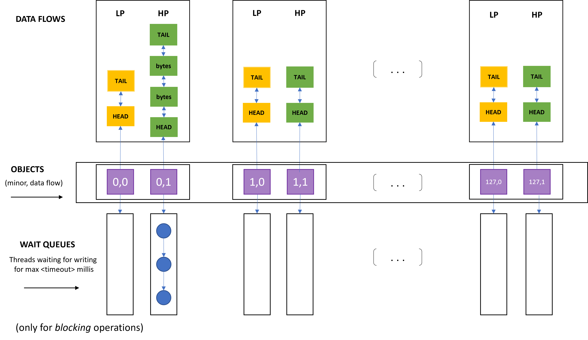

##### Bencivenni Gianmarco - 0285847 - SOA A.A. 2021/2022

# **Multi-flow device file**

## Specifiche di progetto
----

" This specification is related to a Linux device driver implementing low and high priority flows of data. 
Through an open session to the device file a thread can read/write data segments. 
The data delivery follows a First-in-First-out policy along each of the two different data flows (low and high priority). 
After read operations, the read data disappear from the flow. 
Also, the high priority data flow must offer synchronous write operations while the low priority data flow must offer an asynchronous execution (based on delayed work) of write operations, while still keeping the interface able to synchronously notify the outcome. 
Read operations are all executed synchronously. 
The device driver should support 128 devices corresponding to the same amount of minor numbers.
The device driver should implement the support for the ioctl(..) service in order to manage the I/O session as follows:
- setup of the priority level (high or low) for the operations
- blocking vs non-blocking read and write operations
- setup of a timeout regulating the awake of blocking operations

A few Linux module parameters and functions should be implemented in order to enable or disable the device file, in terms of a specific minor number. If it is disabled, any attempt to open a session should fail (but already open sessions will be still managed). 
Further additional parameters exposed via VFS should provide a picture of the current state of the device according to the following information:
- enabled or disabled
- number of bytes currently present in the two flows (high vs low priority)
- number of threads currently waiting for data along the two flows (high vs low priority) "

## Implementazione
----

#### **File Operations**

Realizzare il *char device driver* sopra descritto significa andare a specificare il comportamento delle *file operations*, quindi fornire una specifica implementazione della logica che il driver deve mettere in atto nel momento in cui un thread di livello utente va ad invocare i servizi per operare in I/O (syscall open, write, read, ioctl, close) su uno dei 128 device file di sua competenza.
```C
static int dev_open(struct inode *, struct file *);
static int dev_release(struct inode *, struct file *);
static ssize_t dev_write(struct file *, const char *, size_t, loff_t *);
static ssize_t dev_read(struct file *filp, char *buff, size_t len, loff_t *off);
static long dev_ioctl(struct file *, unsigned int, unsigned long);
```
L'implementazione di questi servizi è circoscritta all'interno di un *kernel module*, che viene montato dinamicamente nell'istanza del kernel Linux in esecuzione, ed è pronto all'uso senza necessità di reboot del sistema. 
Il mapping tra i servizi sopra citati e le rispettive implementazioni viene gestito tramite la struct *file_operations*: questa struttura dati è definita in *linux/fs.h*, e contiene i puntatori alle funzioni definite dal driver che eseguono le varie operazioni sul device file.

```C
static struct file_operations fops = {
    .owner = THIS_MODULE,
    .write = dev_write,
    .read = dev_read,
    .open = dev_open,
    .release = dev_release,
    .unlocked_ioctl = dev_ioctl};
```

#### **Strutture dati per la gestione dei data flows**

Il numero di char devices che il driver deve andare a gestire è pari a 128. 
Ciò si traduce nel fatto che ci saranno 128 device file associati rispettivamente ad altrettanti minor numbers, che verranno usati dal driver come discriminante per andare ad operare su dei segmenti di memoria kernel piuttosto che su altri.
A valle della registrazione del driver, una volta ottenuto il major number, viene eseguita una *mknod* per ogni nodo da aggiungere al file system, indicando il path (si è usato il percorso *"/dev/my-device<minor>"*) e il major number che identifica il driver di gestione per questo device:

```C
for (i = 0; i < MINORS; i++)
        {
                sprintf(buff, "mknod %s%d c %d %i", path, i, major, i);
                system(buff);
        } 
```

Ad ogni minor sono associati due data-flows, uno ad alta priorità ed uno a bassa priorità.
Uno user thread che vuole accedere in scrittura/lettura su uno specifico device file deve aprire una nuova sessione di I/O su di esso e specificarne eventualmente i parametri, tramite il servizio ioctl. 
I parametri di default per la sessione di I/O sono settati a: High Priority, Non-Blocking operations.

```C
typedef struct _session{
    int priority; // indica quale dei due data flows utilizzare per le operazioni di r/w.
    int blocking; // indica se le chiamate r/w debbano essere bloccanti o meno per il thread chiamante.
    unsigned long timeout; // nel caso di chiamate bloccanti, tempo massimo (millisecondi) di blocco per il thread chiamante.
} session;
```

Una volta aperta e configurata una sessione di I/O su un device file e su uno specifico data flow, l'implementazione dei servizi di r/w richiede la presenza di una struttura dati per la gestione della sincronizzazione delle operazioni eseguite eventualmente da più user thread in concorrenza.
La struct *object_state* rappresenta lo stato corrente di un singolo stream (data flow). 

```C
typedef struct _object_state
{
        struct mutex operation_synchronizer;
        data_segment *head;                     // head della lista doppiamente collegata che rappresenta lo stream corrente.
        data_segment *tail;                     // tail della lista doppiamente collegata che rappresenta lo stream corrente.
        int valid_bytes;                        // bytes validi correntemente scritti nello stream corrente.
        int pending_bytes;                      // bytes pendenti da scrivere nello stream secondo uno schema deferred.
        wait_queue_head_t wq;                   // struttura a coda per i thread in stato di blocco, in attesa di effettuare operazioni di r/w.

} object_state;

object_state objects[MINORS][DATA_FLOWS];
```

Questa struttura dati contiene un puntatore alla *head* e alla *tail* di una lista doppiamente collegata che rappresenta il flusso stesso. I nodi head e tail non contengono contenuto informativo in termini di bytes appartenenti al flusso, e una volta inizializzati non subiscono modifiche. La loro funzione è quella di ottimizzare le operazioni di scrittura e lettura, che prevedono inserimenti in coda e cancellazioni in testa allo stream.
Le letture seguono logica FIFO, pertanto andranno a prelevare i bytes da leggere in testa alla coda, cancellando i nodi non appena risultino completamente consumati.
Le scritture accodano nuovi nodi alla lista, per questo il puntatore alla tail evita di dover effettuare operazioni di scorrimento ad ogni inserimento.

```C
typedef struct _data_segment
{
        char *buffer;
        size_t actual_size;
        off_t  off;
        struct _data_segment *next;
        struct _data_segment *previous;
        
} data_segment;
```

Questa struttura rappresenta il segmento di dati, ovvero un nodo dello stream.
Contiene un buffer di caratteri, la sua size, puntatori ai nodi precedente e successivo dello stream, e un offset.
Il campo offset viene utilizzato sostanzialmente nelle letture, per mantenere lo spiazzamento rispetto all'inizio del buffer a cui si è arrivati a leggere. 
Importante notare che, nel momento in cui un lettore legge un numero di bytes tale per cui non vengono consumati tutti i bytes di un segmento di dati, i bytes letti non vengono immediatamente eliminati dallo stream: l'eliminazione dei bytes letti avviene ogni volta che il buffer di un data segment è stato completamente consumato, in altre parole fino a che l'offset non eguagli il valore della size del segmento di dati.

Segue una rappresentazione astratta della struttura del software su cui va ad operare il driver in un istante generico dell'esecuzione del sistema.



#### **Registrazione del driver e inizializzazione**

Nella *init_module*:
- per ogni data flow (high priority, low priority) associato ad ognuno dei device file (128 minors), si procede ad inizializzare la struttura dati di gestione del flusso di dati (*object_state*). In particolare:
    - viene inizializzato un mutex per la sincronizzazione delle operazioni di lettura e scrittura sul flusso di dati.
    - viene inizializzata una Wait Queue, necessaria ad accodare i threads in attesa di poter scrivere nello stream, nello scenario di operazioni di lettura o scrittura bloccanti.
    - viene allocata la quantità di memoria necessaria ad ospitare le strutture dati data_segment per la head e la tail della lista doppiamente collegata rappresentate lo stream (data flow).
- viene effettuata la registrazione del driver, indicandone nome e il puntatore a fops (il major number assegnato al driver è quello restituito come valore di ritorno dal servizio invocato, e può dunque variare).

```C
int init_module(void) {

   int i, j;
   // initialize the driver internal state
   for (i = 0; i < MINORS; i++)
   {

      for (j = 0; j < DATA_FLOWS; j++)
      {

         mutex_init(&(objects[i][j].operation_synchronizer));

         objects[i][j].head = kzalloc(sizeof(data_segment), GFP_KERNEL);
         objects[i][j].tail = kzalloc(sizeof(data_segment), GFP_KERNEL);
         if (objects[i][j].head == NULL || objects[i][j].tail == NULL)
         {
            printk("%s: unable to allocate a new data_segment\n", MODNAME);
            goto revert_allocation;
         }

         objects[i][j].head->next = (objects[i][j].tail);
         objects[i][j].head->previous = NULL;
         objects[i][j].head->buffer = NULL;

         objects[i][j].tail->next = NULL;
         objects[i][j].tail->previous = (objects[i][j].head);
         objects[i][j].tail->buffer = NULL;

         init_waitqueue_head(&objects[i][j].wq);

      }
   }

   Major = __register_chrdev(0, 0, 256, DEVICE_NAME, &fops);
   // some other stuff ...
```

#### **Operazioni di Scrittura (sincrone e asincrone)**

La *dev_write* effettua un certo numero di controlli prima di andare a richiamare la sezione "core" in cui viene di fatto effettuata la scrittura sul data flow, che consiste semplicemente nel collegamento di un nuovo nodo in coda alla lista doppiamente collegata.

Si schematizzano a seguire le operazioni effettuate dalla *dev_write*.

- Viene allocata la memoria necessaria a contenere un nuovo segmento di dati (nuovo nodo da inserire nello stream).
- Viene effettuata una *copy_from_user* dei bytes scritti dall'utente sul buffer relativo al nuovo nodo.
- Il thread che tenta una **scrittura bloccante**:
    - prova ad acquisire il lock sullo stream corrente per scrivere un certo numero di bytes.
    - va in blocco, e viene accodato nella relativa Wait Queue, se e finché vale una delle seguenti condizioni:
        - il timer configurato non sia scaduto (se il timeout scade prima che le condizioni seguenti si verifichino l'operazione viene abortita e il segmento di dati deallocato)
        - il lock sullo stream sia posseduto da un altro user thread
        - non ci sia più spazio disponibile nello stream per scrivere
    - la funzione utilizzata per accodare il thread nella wait queue è la *wait_event_interruptible*, che prende come argomento, oltre che un puntatore alla wait queue, il timeout (in millisecondi) configurato dall'utente e la condizione per il risveglio, definita nelle seguenti linee di codice:
    
```C
int writable_bytes( object_state *the_object, int priority ) {
   if (priority == HIGH_PRIORITY)
      return OBJECT_MAX_SIZE - (the_object -> valid_bytes);
   else
      return OBJECT_MAX_SIZE - (the_object -> valid_bytes) - (the_object -> pending_bytes);
}


int check_if_writable_and_try_lock(object_state *the_object, int priority) {
   if(mutex_trylock(&(the_object -> operation_synchronizer))) {
      if(writable_bytes(the_object, priority) == 0) {
            mutex_unlock(&(the_object -> operation_synchronizer));
            return 0;
      }
      return 1;
   }
   return 0;
}
```
- Il thread che tenta una **scrittura non bloccante**:
    - prova ad acquisire il lock sullo stream corrente per scrivere un certo numero di bytes.
    - l'operazione viene abortita se:
        - il lock sullo stream sia posseduto da un altro user thread
        - non ci sia più spazio disponibile nello stream per scrivere

- Le **operazioni di scrittura** sono **sincrone** nel caso in cui lo user thread scriva con priorità alta. In questo caso la *dev_write* va a richiamare direttamente la funzione definita in *write.h*:

```C
size_t write( data_segment *new_segment, object_state *current_stream_state ) {
        data_segment *tail;
        
        tail =  current_stream_state -> tail;

        new_segment -> previous = tail->previous;
        new_segment -> next = tail;

        tail->previous -> next = new_segment;
        tail->previous = new_segment;

        current_stream_state -> valid_bytes += new_segment -> actual_size;

        return new_segment -> actual_size;
}

```

- Le **scritture asincrone** sul data flow a bassa priorità sono implementate secondo uno schema di *deferred work*. L'implementazione è basata sull'utilizzo delle *Work Queues* di sistema: il work da portare a termine secondo uno schema deferred è la write su device file, e verrà eseguita da un kernel daemon in un secondo momento. La struttura dati contenente i metadati utilizzati per il lavoro deferred è così definita:

```C
typedef struct _packed_work
{
        int major;
        int minor;
        object_state *the_stream_state;
        data_segment *new_segment;
        struct work_struct  the_work;

} packed_work;
```

- La *dev_write* va a richiamare la *put_work*, che si occupa di inizializzare il lavoro da svolgere in modalità asincrona, popolando una struttura packed_work e utilizzando i servizi di sistema per la schedulazione dell'attività, oltre che **incrementare il numero di bytes pendenti da scrivere sullo stream**, che dovranno essere tenuti in considerazione (come spazio già occupato sullo stream) ai fini dei controlli sulle eventuali operazioni di scrittura invocate nell'intervallo di tempo in cui questo task rimane in attesa di essere effettivamente eseguito.

```C
void deferred_write(unsigned long data) {
        packed_work *the_task = (packed_work *) container_of( (void*) data, packed_work, the_work );
        AUDIT printk("%s kworker %d handles async write operation on device [MAJOR: %d, minor: %d]",
               MODNAME, current->pid, the_task->major, the_task->minor);

        mutex_lock( &( the_task->the_stream_state->operation_synchronizer) );
        the_task->the_stream_state->pending_bytes -= write(the_task->new_segment, the_task->the_stream_state);
        mutex_unlock( &( the_task->the_stream_state->operation_synchronizer) );

        wake_up_interruptible(&(the_task->the_stream_state->wq));

        kfree(the_task);

        module_put(THIS_MODULE);
}


int put_work( object_state *current_stream_state, data_segment *new_segment, int major, int minor, gfp_t flags ) {
        
        packed_work *the_task;
        int ret;

        if(!try_module_get(THIS_MODULE))
                return -ENODEV;

        the_task = (packed_work *)kzalloc(sizeof(packed_work), flags);
        if(unlikely(the_task == NULL))
                return -ENOMEM;

        the_task -> major = major;
        the_task -> minor = minor;
        the_task -> the_stream_state = current_stream_state;
        the_task -> new_segment = new_segment;

        ret = new_segment -> actual_size;

        __INIT_WORK(&(the_task -> the_work), (void*) deferred_write, (unsigned long)(&(the_task -> the_work)));
        schedule_work( &the_task -> the_work );

        current_stream_state -> pending_bytes += ret;

        return ret;
}
```

- Al ritorno dalla *write* (nel caso sincrono) o dalla *put_work* (nel caso asincrono) viene rilasciato il lock sullo stream ed invocata una *wake_up_interruptible* sulla Wait Queue per risvegliare eventuali threads in blocco.

Per ulteriori dettagli implementativi si rimanda al codice sorgente nel file *write.h*.

#### **Operazioni di Lettura (sincrone)**

Le operazioni di lettura sono sincrone in ogni caso.
La logica di consegna dei messaggi segue uno schema First In First Out, e i bytes letti devono esser cancellati dallo stream.
Come anticipato, i bytes letti vengono effettivamente eliminati dallo stream solo quando l'intero buffer di un nodo è stato completamente consumato. Nel caso in cui si ha una lettura parziale del buffer, l'offset ad esso relativo viene aggiornato e alla lettura successiva si riparte da quel punto.
La funzione *dev_read* effettua controlli simili a quelli descritti per la *dev_write* per quanto riguarda le letture bloccanti/non bloccanti: la differenza è sostanzialmente nel fatto che la lettura è bloccante nel momento in cui non siano presenti bytes validi da leggere all'interno dello stream.
La *copy_to_user* è in questo caso richiamata nella funzione *read* del file read.h, durante lo scorrimento della struttura collegata.


```C
int read(object_state *current_stream_state, char __user *buff, size_t len) {

   int res;
   size_t read_bytes, current_readable_bytes, current_read_len;
   data_segment *current_segment, *head;

   if (unlikely(current_stream_state -> valid_bytes == 0))
            return -EAGAIN;

   read_bytes = 0;

   head = current_stream_state -> head;

   while ((head -> next != current_stream_state -> tail) && (len > read_bytes)) {
      
      current_segment = head -> next;
      current_readable_bytes = current_segment -> actual_size - current_segment -> off;
      current_read_len = MIN(len - read_bytes, current_readable_bytes);

      res = copy_to_user(buff + read_bytes, &(current_segment -> buffer[current_segment -> off]), current_read_len);

      read_bytes += ( current_read_len - res );
      current_segment -> off += ( current_read_len - res );

      if (current_segment -> off == current_segment -> actual_size) {
               head->next = head->next->next;
               head->next->previous = head;

               kfree(current_segment -> buffer);
               kfree(current_segment);
      }

      if (unlikely(res != 0))
               break;
   }

   current_stream_state->valid_bytes -= read_bytes;

   return read_bytes;
}
```


#### **Parametri del kernel module**

I parametri del modulo sviluppato possono essere consultati nel file *info.h*.

```C
static int disabled_device[MINORS];
module_param_array(disabled_device, int, NULL, 0660);
MODULE_PARM_DESC(disabled_device, "Parameter to enable or disable " \
"the device file, in terms of a specific minor number. If it is disabled, " \
"any attempt to open a session should fail (but already open sessions will still be managed).");

static int hp_bytes[MINORS];
module_param_array(hp_bytes, int, NULL, 0660);
MODULE_PARM_DESC(hp_bytes, "Current number of bytes in the High Priority flow.");

static int lp_bytes[MINORS];
module_param_array(lp_bytes, int, NULL, 0660);
MODULE_PARM_DESC(lp_bytes, "Current number of bytes in the Low Priority flow.");

static int hp_threads[MINORS];
module_param_array(hp_threads, int, NULL, 0660);
MODULE_PARM_DESC(hp_threads, "Number of threads currently waiting for data along the High Priority flow.");

static int lp_threads[MINORS];
module_param_array(lp_threads, int, NULL, 0660);
MODULE_PARM_DESC(lp_threads, "Number of threads currently waiting for data along the Low Priority flow.");
```